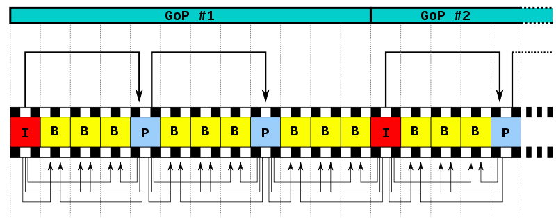

# GOP(Group of Pictures)

## 概念解释

GOP主要指两个I帧之间的间隔。简单解释：假设视频流为720p60fps，GOP为120，那就是每2秒出现一次I帧，如果GOP为30，那就是1秒出现两次I帧。

在视频编码序列中，主要有三种编码帧：I帧、P帧、B帧。

- **I帧**即Intra-coded Picture（帧内编码图像帧），不参考其他图像帧，只**利用本帧**的信息进行编码
- **P帧**即Predictive-coded Picture（预测编码图像帧），利用之前的I帧或P帧，采用运动预测的方式**进行帧间预测编码**
- **B帧**即Bidirectionally Predicted Picture（双向预测编码图像帧)，提供最高的压缩比，它既需要之前的图
  像帧(I帧或P帧)，也需要后来的图像帧(P帧)，采用运动预测的方式进行帧间双向预测编码

不同帧数据量比较：I帧 > P帧 > B帧

## GOP值对图像质量的影响

在码率不变的前提下，GOP的值越大，P、B帧的数量越多，平均每个I、P、B帧所占用的字节数就越多，也就更容易获取较好的图像质量；Reference越大，B帧的数量越多，同理也更容易获得较好的图像质量。

需要说明的是，通过提高GOP值来提高图像质量是有限度的，在遇到场景切换的情况时，H.264编码器会自动强制插入一个I帧，此时实际的GOP值被缩短了。另一方面，在一个GOP中，P、B帧是由I帧预测得到的，当I帧的图像质量比较差时，会影响到一个GOP中后续P、B帧的图像质量，直到下一个GOP开始才有可能得以恢复，所以GOP值也不宜设置过大。

由于P、B帧的复杂度大于I帧，所以过多的P、B帧会影响编码效率，使编码效率降低。

过长的GOP还会影响Seek操作的响应速度，由于P、B帧是由前面的I或P帧预测得到的，所以Seek操作需要直接定位，解码某一个P或B帧时，需要先解码得到本GOP内的I帧及之前的N个预测帧才可以，GOP值越长，需要解码的预测帧就越多，seek响应的时间也越长。

## H.264中的I帧，B帧和P帧

在H264中的图像以**序列**为单位进行组织，一个序列是一段图像编码后的数据流，以I帧开始，到下一个I帧结束。

**IDR图像**：一个序列的第一个图像叫做IDR（Instantaneous Decoding Refresh，立即刷新图像），IDR 图像都是I帧图像。H.264引入IDR图像是为了解码的重同步，当解码器解码到IDR图像时，立即将DPB（Decoded Picture Buffer，解码图像缓冲区，参考帧队列）清空，将已解码的数据全部输出或抛弃，重新查找参数集，开始一个新的序列。这样，如果前一个序列出现重大错误，在这里获得重新同步的机会。IDR图像之后的图像永远不会使用IDR之前的图像数据来解码。

**IDR图像一定是I图像，但I图像不一定是IDR图像**

